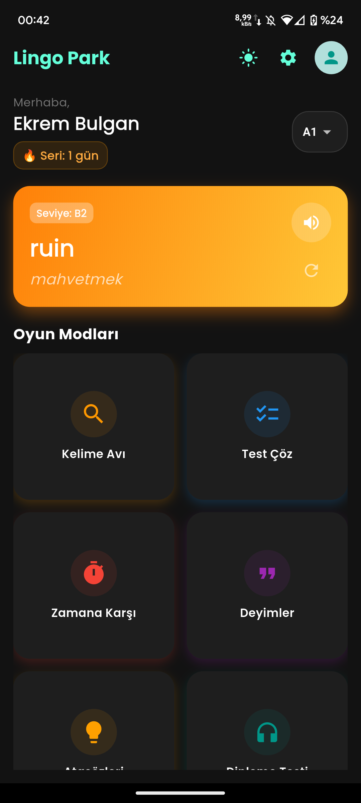
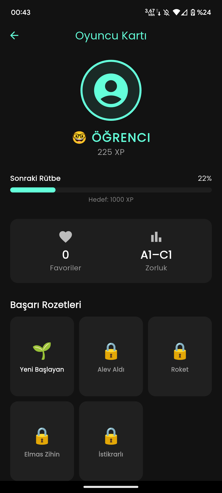
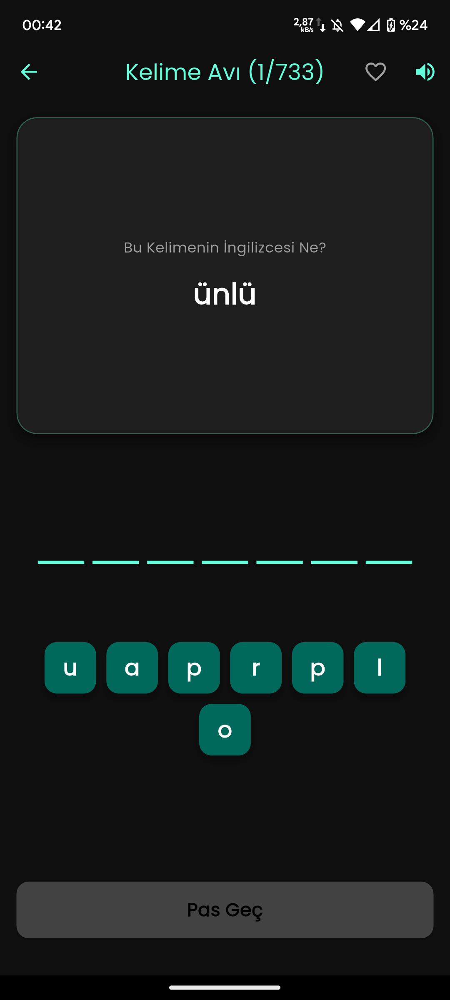
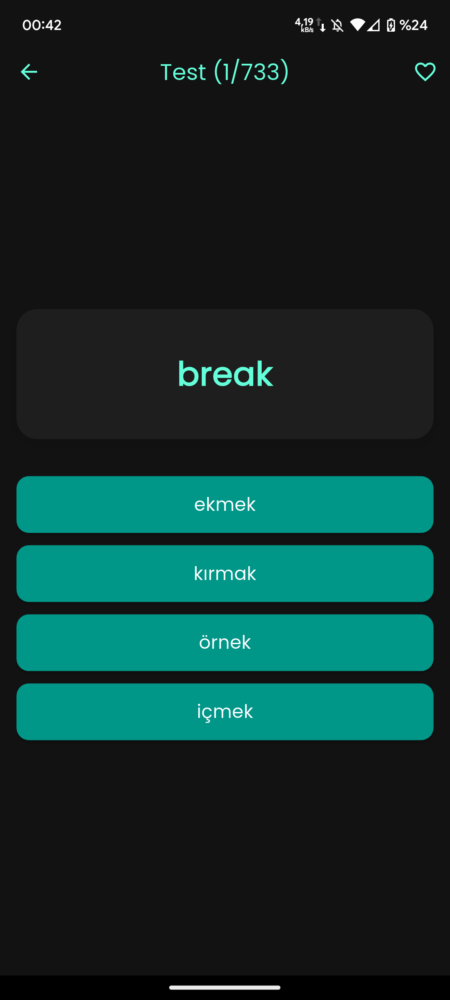
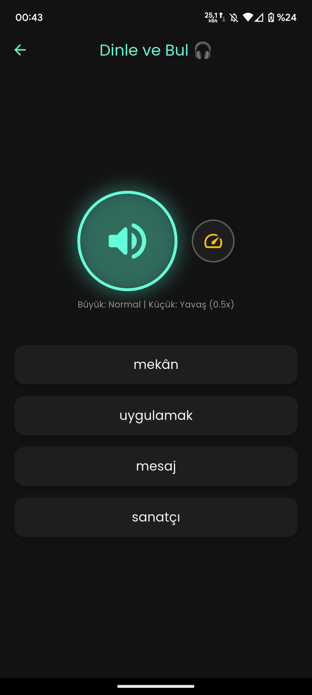

---

# 🦁 Lingo Park – İngilizce Kelime Öğrenme Uygulaması

## ⚠️ License Notice

This project is **NOT open-source**.

Any previous open-source license (MIT, GPL, etc.) is no longer applicable  
to new versions of this repository.

Unauthorized use, redistribution, modification, or republication  
of this software or its binaries is strictly prohibited.

This repository may contain legacy references to open-source licenses.  
Those references apply **only to deprecated versions** and are no longer valid.

---

**Lingo Park**, İngilizce kelime öğrenmeyi oyunlaştırarak eğlenceli ve kalıcı hale getiren,  
modern arayüze sahip bir **Android mobil uygulamasıdır**.

Kelime oyunları, dinleme testleri ve okuma parçaları ile **A1–C1** seviyeleri hedeflenir.

---

## 🎯 Kimler İçin?

- İngilizce kelime bilgisini eğlenerek geliştirmek isteyenler  
- Offline çalışabilen bir uygulama arayanlar  
- Günlük pratikle istikrarlı ilerlemek isteyen öğrenciler  
- Duolingo benzeri ama **reklamsız ve sade** bir alternatif isteyenler  

---

## 📱 Uygulama Görselleri

| Ana Sayfa | Profil | Ayarlar |
|:--:|:--:|:--:|
|  |  |  |

| Kelime Avı | Test | Dinle & Bul |
|:--:|:--:|:--:|
|  |  |  |

---

## ✨ Temel Özellikler

- 🎮 **4 Oyun Modu** (Kelime Avı, Test, Dinleme, Zamana Karşı)
- 📚 Binlerce kelime, deyim ve atasözü
- 🏆 XP sistemi, rozetler ve günlük seri takibi
- 💾 **Tamamen Offline** çalışma
- 🌙 Karanlık Mod desteği

---

## 🚀 İndir ve Dene (APK)

1. APK dosyasını indir  
2. Telefonuna kur  
3. Oynamaya başla  

> Android güvenlik uyarısı çıkarsa **“Yine de Yükle”** seçeneğini kullanabilirsin.

---

## 🛠️ Kullanılan Teknolojiler

- Flutter & Dart  
- Isar Database  
- Flutter TTS  
- AudioPlayers  
- Shared Preferences  

---

## 📄 About This Repository

Source code is **private** and not included in this repository.  
This repository is intended for **binary distribution and documentation only**.

No developer setup or source code instructions are provided.

---

🧠 **The Training Arc**

Bu proje, kişisel *training arc*’ımın bir parçasıdır.  
Amaç yalnızca bir oyun değil, sürdürülebilir öğrenme ve gelişimi test etmektir.
